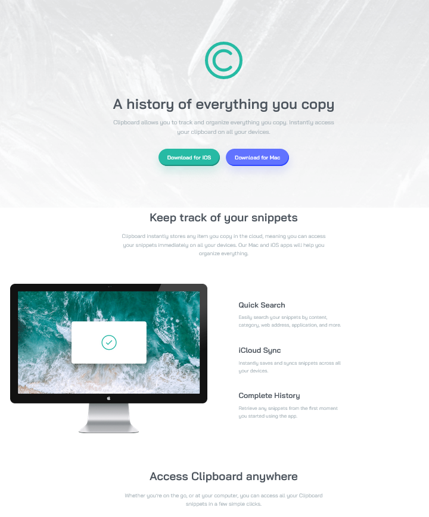

# Frontend Mentor - Clipboard landing page solution

This is a solution to the [Clipboard landing page challenge on Frontend Mentor](https://www.frontendmentor.io/challenges/clipboard-landing-page-5cc9bccd6c4c91111378ecb9).

## Table of contents

- [Overview](#overview)
  - [The challenge](#the-challenge)
  - [Screenshot](#screenshot)
  - [Links](#links)
- [My process](#my-process)
  - [Built with](#built-with)
  - [What I learned](#what-i-learned)
  - [Useful resources](#useful-resources)
- [Author](#author)

## Overview

### The challenge

Users should be able to:

- View the optimal layout for the site depending on their device's screen size
- See hover states for all interactive elements on the page

### Screenshot

### Links

- Solution URL: [Click](https://www.frontendmentor.io/solutions/responsive-landing-page-with-sass-ON0t1tUiOb)
- Live Site URL: [Click](https://jwalczak94.github.io/Clipboard-landing-page/)

## My process

### Built with

- VSCode
- Semantic HTML5 markup
- CSS custom properties
- Flexbox
- CSS Grid
- 

### What I learned

This was my first major project where I could focus on creating more reusable components and practicing CSS and SASS skills

### Useful resources

- [FLEXBOX](https://css-tricks.com/snippets/css/a-guide-to-flexbox/) - I really liked this page and will use it going forward.
- [CSS GRID](https://css-tricks.com/snippets/css/complete-guide-grid/) - This is an amazing article which helped with the Grid Layout. I'd recommend it to anyone still learning this concept.

## Author

- Website - [J.Walczak](https://github.com/jwalczak94)
- Frontend Mentor - [@jwalczak94](https://www.frontendmentor.io/profile/jwalczak94)
